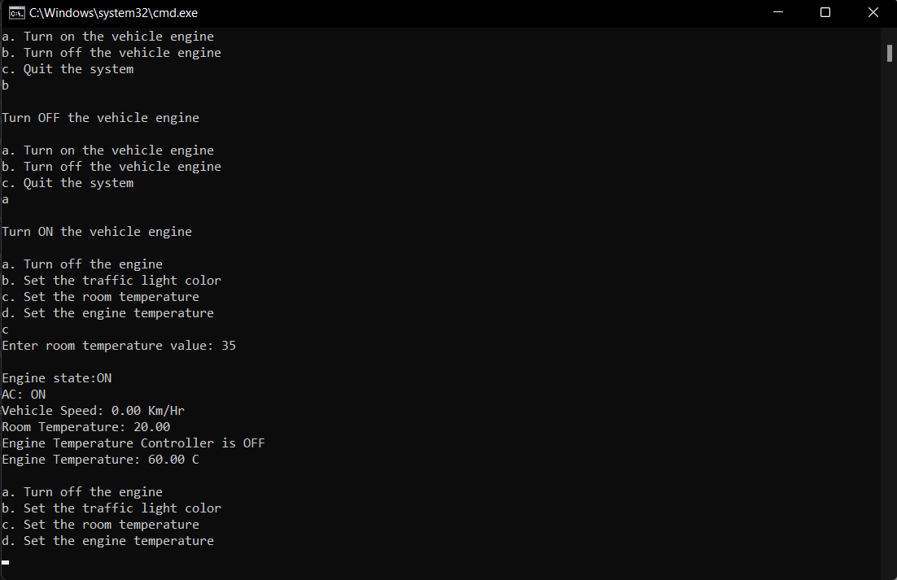

# Vehicle-Control-System
<h6>A simulation for a vehicle control dashboard using C language. </h6>

>### System Specifications:

1. It prompts the user to choose weather to:
&emsp;*a. Turn on the vehicle engine.*
&emsp;*b. Turn off the vehicle engine.*
&emsp;*c. Quit the system.*

2. Once a choice has been made, the system state is displayed.
3. ***`Turn on the vehicle engine`*** displays the **Sensors set menu**, which simulates the vehicle sensors readings:
&emsp;*a. Turn off the engine.*
&emsp;*b. Set the traffic light color.*
&emsp;*c. Set the room temperature (Temperature Sensor).*
&emsp;*d. Set the engine temperature (Engine Temperature Sensor).*
4. While the engine is ON, **Sensors set menu** is always displayed, and the dashboard waits for an input.
5. Based on the input taken:
**a. Based on traffic light data received from a sensor:**
&emsp;&emsp;i. If the traffic light is ‘G’ set vehicle speed to 100 km/hr
&emsp;&emsp;ii. If the traffic light is ‘O’ set vehicle speed to 30 km/hr
&emsp;&emsp;iii. If the traffic light is ‘R’ set vehicle speed to 0 km/h
**b. Based on room temperature data from temperature sensor:**
&emsp;&emsp;i. If temperature less than 10, Turn AC ON and set temperature to 20
&emsp;&emsp;ii. If temperature is greater than 30, Turn AC ON and set temperature to 20
&emsp;&emsp;iii. If temperature is otherwise, Turn AC OFF
**c. Based on engine temperature data from engine temperature sensor:**
&emsp;&emsp;i. If temperature less than 100, Turn “Engine Temperature Controller” ON and set temperature to 125
&emsp;&emsp;ii. If temperature is greater than 150, Turn “Engine Temperature Controller” ON and set temperature to 125
&emsp;&emsp;iii. If temperature is otherwise, Turn “Engine Temperature Controller” OFF
**d. If vehicle speed is 30 km/hr:**
&emsp;&emsp;i. Turn ON AC if it was OFF and set room temperature to: current temperature * (5/4) + 1
&emsp;&emsp;ii. Turn ON “Engine Temperature Controller” if it was OFF and set engine temperature to: current temperature * (5/4) + 1
**e. Display the current vehicle state after applying any of the above options:**
&emsp;&emsp;i. Engine state: ON/OFF.
&emsp;&emsp;ii. AC: ON/OFF.
&emsp;&emsp;iii. Vehicle Speed.
&emsp;&emsp;iv. Room Temperature.
&emsp;&emsp;v. Engine Temperature Controller State.
&emsp;&emsp;vi. Engine Temperature.
***Notice that: In the simulation, the sensor read values are taken as an input from the console***
>### System Simulation:

